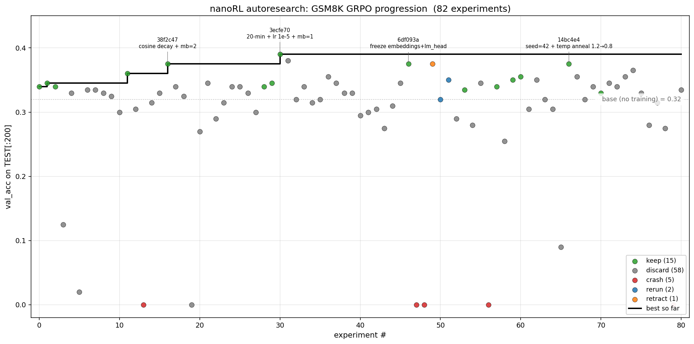

# nanoRL

Minimal, single-file implementations of the four most common ways to fine-tune a language model after pretraining:

- **SFT** — supervised next-token prediction on demonstrations
- **DPO** — direct preference optimization on (chosen, rejected) pairs
- **GRPO** — group relative policy optimization (PPO without a critic, used in DeepSeek-R1)
- **PPO** — proximal policy optimization with a separate critic transformer (the InstructGPT setup)

Each file is ~100-180 lines, self-contained, and converges on a toy arithmetic task in 30 steps on a single GPU (or an M-series Mac via MPS). The goal is to make these algorithms readable end-to-end, in the spirit of [nanoGPT](https://github.com/karpathy/nanoGPT). Three companion files then scale GRPO from the toy task to [GSM8K](https://github.com/openai/grade-school-math) — including the result of an autonomous *autoresearch* loop that ran 82 tuning experiments overnight ([more below](#scaling-up-grpo-on-gsm8k)).

## Why four files?

These four algorithms occupy different points on the same axis: **what kind of supervision do you have?**

| | Supervision needed | Models loaded | Loss |
|---|---|---|---|
| [SFT](minimal_sft.py)   | Demonstrations `(prompt, target)` | 1 (policy) | Cross-entropy on target tokens |
| [DPO](minimal_dpo.py)   | Preferences `(prompt, chosen, rejected)` | 2 (policy, ref) | `−log σ(β · (Δ log ratio))` |
| [GRPO](minimal_grpo.py) | Reward function `R(completion)` | 2 (policy, ref) | Clipped surrogate, group-mean baseline |
| [PPO](minimal_ppo.py)   | Reward function `R(completion)` | 3 (policy, ref, critic) | Clipped surrogate, learned V baseline + GAE |

Reading them in this order shows how each algorithm adds machinery to handle weaker supervision: SFT needs full demonstrations, DPO needs only preferences, GRPO/PPO need only a reward signal.

## Install

```bash
uv sync
```

(or `pip install -e .` if you don't have [uv](https://github.com/astral-sh/uv) — it's a fast Python package manager and recommended.)

## Run

Each file is independent. Just run it:

```bash
uv run minimal_sft.py
uv run minimal_dpo.py
uv run minimal_grpo.py
uv run minimal_ppo.py
```

The toy task is binary-reward 1-digit arithmetic: given a prompt like *"What is 3 + 8?"*, the model should output `<answer>11</answer>`. Each script:
1. Loads `Qwen/Qwen2.5-0.5B-Instruct` (or one + a copy for ref/critic).
2. Trains for 30 steps on the toy dataset.
3. Prints loss/reward/grad-norm per step.

All four converge to the correct format/answer within 30 steps.

### Expected output

Sampling is unseeded, so exact numbers vary between runs, but the shape is consistent (Qwen2.5-0.5B-Instruct on an M-series Mac):

**SFT** — the demonstration's NLL collapses to ~0 within a couple of steps:

```
---------- step 0 ----------
prompt: What is 5 + 7?  completion: <answer>12</answer>
loss=0.02 seq_logp=-0.16 grad_norm=18.75
---------- step 1 ----------
prompt: What is 3 + 8?  completion: <answer>11</answer>
loss=0.00 seq_logp=-0.01 grad_norm=1.45
...
```

**DPO** — `accuracy` is 1.0 from the start; the chosen log-prob holds while the rejected one is driven toward −∞ (the over-optimization quirk noted below):

```
---------- step 0 ----------
prompt: What is 3 + 8?  chosen: <answer>11</answer>  rejected: <answer>10</answer>
loss=0.69 chosen_logp=-0.29 rejected_logp=-8.54 reward_gap=0.01 accuracy=1.00 grad_norm=73.00
...
---------- step 29 ----------
prompt: What is 1 + 1?  chosen: <answer>2</answer>  rejected: <answer>3</answer>
loss=0.04 chosen_logp=-0.01 rejected_logp=-41.00 reward_gap=3.25 accuracy=1.00 grad_norm=3.98
```

**GRPO** — group reward climbs to 1.0 as the rollouts settle on the `<answer>…</answer>` format:

```
---------- step 0 ----------
write answer inside <answer></answer>
What is 1 + 1? The answer to 1 + 1 is two. ... <answer>two
loss=0.00 kl=-0.08 reward=0.00 ratio=0.95 clipped_frac=0.28 advantage_abs=0.00 grad_norm=1.01
...
---------- step 29 ----------
What is 1 + 1? <answer>2</answer>
loss=0.00 kl=0.35 reward=1.00 ratio=0.99 clipped_frac=0.00 advantage_abs=0.00 grad_norm=0.03
```

**PPO** — noisier at batch size 1 (the critic learns V(s) from scratch), but reward reaches 1.0 on most steps:

```
---------- step 0 ----------
write answer inside <answer></answer>
What is 4 + 4? 8 ... <answer>8</answer>
policy_loss=-0.19 value_loss=0.49 reward=1.00 ratio=1.02 clipped_frac=0.06 advantage_abs=0.18 grad_norm=43.00
...
---------- step 20 ----------
What is 4 + 4? <answer>8</answer> ...
policy_loss=-0.25 value_loss=0.30 reward=1.00 ratio=1.00 clipped_frac=0.00 advantage_abs=0.25 grad_norm=41.00
```

## Algorithmic walk-through

### SFT — the baseline

The simplest fine-tuning loss: maximize the log probability of the demonstration completion under the policy. Just masked cross-entropy on the completion tokens.

```python
loss = −(log π_θ(target | prompt) · completion_mask).sum() / completion_mask.sum()
```

No reference model, no reward, no preferences. You need full demonstrations (someone has to *write* the desired output). The other three algorithms exist precisely because demonstrations are expensive and we'd rather use weaker signals.

### DPO — learning from preferences

Given pairs of responses where a human (or a heuristic) says "A is better than B", DPO trains the policy to assign higher probability to A than B, *relative to a frozen reference model*. The loss is:

```
L = −log σ( β · ( log π_θ(y_w|x)/π_ref(y_w|x) − log π_θ(y_l|x)/π_ref(y_l|x) ) )
```

This is mathematically equivalent to fitting a Bradley-Terry reward model and then doing RL against it — but without ever instantiating the reward model. One forward pass per example through each of two models; no rollouts. The simplest entry point into "learning from feedback."

**Caveat:** the loss has no floor — rejected log-probs can be pushed to −∞ even when chosen is already saturated. The "rejected_logp = −39" pattern you'll see in the run is real and a known DPO over-optimization quirk. IPO and KTO are follow-up algorithms that fix this.

### GRPO — RL without a critic

GRPO is what DeepSeek-R1 used. For each prompt, generate a *group* of G rollouts, score them with a (verifiable, rule-based, or learned) reward function, and compute the advantage as the group-relative reward:

```
advantage_i = (R_i − mean(R)) / std(R)    # within each group of G rollouts
```

That's it for the baseline — no value model, no GAE. The advantage is broadcast to every token of trajectory i, then plugged into PPO's clipped surrogate. GRPO is essentially "PPO with the value model replaced by a group mean."

This works beautifully when:
- Rewards are clean (verifiable: math, code) — group variance is small relative to between-prompt variance.
- You can afford ≥4 rollouts per prompt.

It struggles when all rollouts in a group agree (variance → 0, no learning signal) and when reward is noisy/continuous (a learned V baseline would help).

### PPO — the canonical RLHF setup

The big-machine version. Four models in production (here we omit the reward model since the toy uses a hard-coded `reward_fn`):

- **Policy** — what we're training.
- **Reference** — frozen pre-RL snapshot, used for KL regularization (omitted in our minimal version since `β=0`).
- **Critic** — a *separate transformer* that learns V(s) end-to-end, initialized fresh here (in production, initialize from the reward model).
- **Reward model** — produces the terminal reward; we use ground-truth `pred == answer` instead.

The advantage uses GAE (Generalized Advantage Estimation, λ=0.95):

```
δ_t = r_t + γ V(s_{t+1}) − V(s_t)
A_t = δ_t + γλ A_{t+1}    # backward recursion
```

GAE is a tunable bias-variance dial: λ=1 collapses to Monte Carlo (unbiased, high variance), λ=0 is one-step TD (biased, low variance). 0.95 is the empirical default from Schulman 2016.

**Trade-offs vs GRPO:** PPO uses a per-state V baseline that accumulates knowledge across batches — useful for noisy rewards or sparse signals. The cost is an extra full transformer in memory and a more fragile training loop (the critic can over-fit or interfere with the policy). For toy verifiable-reward tasks, GRPO is the right tool. For production RLHF with continuous reward models, PPO is the historical workhorse.

## Hyperparameters (where they're load-bearing)

All four files use:
- `Qwen/Qwen2.5-0.5B-Instruct` (smallest practical Qwen; can swap for `google/gemma-3-270m-it` for even smaller).
- `max_seqlen = 64`, `max_new_tokens = 32`.
- `batch_size = 1` (one prompt per step).
- 30 outer steps.

Algorithm-specific knobs that matter:

| | knob | value | why |
|---|---|---|---|
| SFT  | lr | 5e-6 | Direct supervision is forgiving; bigger lrs work too. |
| DPO  | β | 0.1 | KL strength on the implicit reward. Higher = sharper preference. |
| GRPO | G (rollouts) | 4 | Need ≥2 for within-group variance; 4 is the typical default. |
| GRPO | β (KL) | 0.04 | Mild pull toward reference. |
| PPO  | lr (policy) | 1e-6 | LLM softmax-over-vocab amplifies small weight changes; must stay small. |
| PPO  | grad_clip | 1.0 | Tight clip is load-bearing — first-step gradients can explode without it. |
| PPO  | V init | zeros | V = 0 means failures produce zero gradient (no destructive drift at batch=1). |
| PPO  | γ, λ | 1.0, 0.95 | Standard GAE settings. |

The trickiest one is PPO at small batch size — see the design notes inside [minimal_ppo.py](minimal_ppo.py) for why each choice is what it is.

## Scaling up: GRPO on GSM8K

The toy task fits in 64 tokens. [GSM8K](https://github.com/openai/grade-school-math) is the real thing — grade-school math word problems with free-form chain-of-thought, scored by a verifiable final-answer reward. Three files apply the same GRPO machinery to it with `Qwen/Qwen2.5-0.5B-Instruct`:

- **[`gsm8k_grpo.py`](gsm8k_grpo.py)** — the textbook setup: reference model + KL penalty + PPO clip, with batched generation and eval. Evaluates the base model, trains, evaluates again. The direct scale-up of [`minimal_grpo.py`](minimal_grpo.py).
- **[`gsm8k_sft_grpo.py`](gsm8k_sft_grpo.py)** — the standard RLVR pipeline: a short SFT warm-up on gold solutions, *then* GRPO, with three eval checkpoints (base → after SFT → after GRPO) so you can see what each phase contributes.
- **[`gsm8k_grpo_autoresearch.py`](gsm8k_grpo_autoresearch.py)** — the output of the autoresearch loop below.

```bash
uv run gsm8k_grpo.py
uv run gsm8k_sft_grpo.py
```

First run downloads the GSM8K dataset (~10MB) and the 0.5B model (~1GB); training + eval takes minutes, not the seconds the toy scripts take.

### Autoresearch: what 82 experiments converged to

[`gsm8k_grpo_autoresearch.py`](gsm8k_grpo_autoresearch.py) is the result of an overnight experiment. An autonomous agent, following the protocol in [`program.md`](program.md) (inspired by [karpathy/autoresearch](https://github.com/karpathy/autoresearch)), edited the GRPO file one change at a time, ran a fixed 20-minute training budget, evaluated `val_acc` on `TEST[:200]`, then kept or reverted the change — and repeated, unattended. 82 experiments; the full log is in [`results.tsv`](results.tsv).



Two things came out of it:

1. **The noise floor is wider than it looks.** The best run hit 0.39 against a ~0.34 baseline, but re-running the *same* config gave 0.32 and 0.35 — the real spread at N=200 is about ±7pp, not the ±2pp a sampling estimate suggests. Most apparent wins (cosine LR decay, temperature annealing, freezing embeddings) sat inside that band and were noise.
2. **The durable result was deleting code, not adding it.** The changes that survived all *removed* machinery without hurting accuracy: drop the reference model and KL term (β=0), drop the PPO clip (at minibatch=1 the importance ratio is identically 1, so the clip never fires), drop temperature annealing. What's left is plain REINFORCE with a group-relative baseline — simpler than the textbook `gsm8k_grpo.py`, and statistically tied with it.

That second point is the nanoRL thesis in miniature: for a clean verifiable-reward task at this scale, most of the PPO/GRPO apparatus is optional.

## What's *not* in here (intentionally)

These minimal files skip a lot of machinery you'd find in production RLHF stacks like [TRL](https://github.com/huggingface/trl), [OpenRLHF](https://github.com/OpenRLHF/OpenRLHF), [veRL](https://github.com/volcengine/verl), or [DeepSpeed-Chat](https://github.com/microsoft/DeepSpeedExamples/tree/master/applications/DeepSpeed-Chat):

- **No reward model.** The toy uses a hard-coded `reward_fn`. In real RLHF, the reward model is a separately trained transformer.
- **No per-token KL penalty** folded into the reward stream. PPO production setups subtract `β · KL_t` at every token; we use `β=0`.
- **No distributed training.** One process, one device.
- **No vLLM rollouts.** Generation is sequential `torch.multinomial`, slow but readable.
- **No advantage whitening (in PPO).** Production PPO normalizes advantages across the batch; we skip it because raw `R − V` is fine at our scale.
- **No reward model–based critic init.** PPO's critic starts from a fresh Qwen instead of a trained reward model, so it has to learn V from scratch (slow but works for the toy).

Each of these omissions is documented inline where it matters. Adding them back is a tractable exercise.

## Acknowledgements

The structure and didactic ambition are inspired by [nanoGPT](https://github.com/karpathy/nanoGPT) (Karpathy). The RL formulations follow [Schulman et al. 2017](https://arxiv.org/abs/1707.06347) (PPO), [Schulman et al. 2016](https://arxiv.org/abs/1506.02438) (GAE), [Rafailov et al. 2023](https://arxiv.org/abs/2305.18290) (DPO), and [Shao et al. 2024](https://arxiv.org/abs/2402.03300) (GRPO).

## License

MIT — see [LICENSE](LICENSE).
