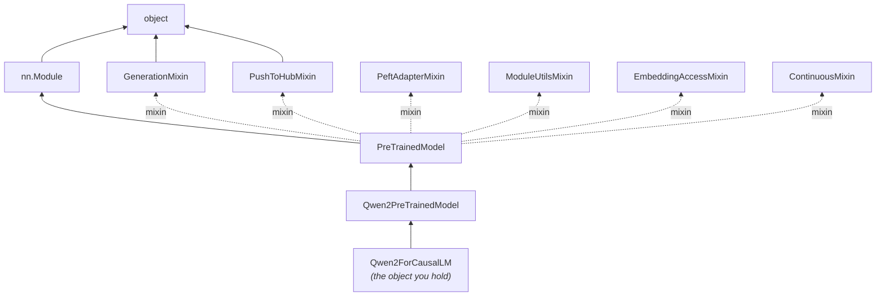
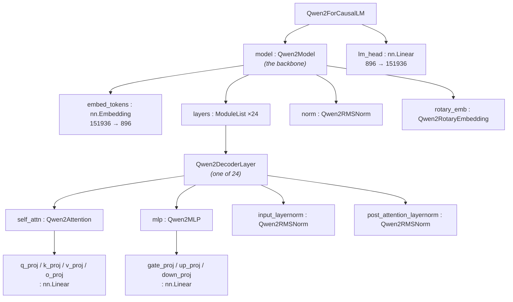

# How the Qwen model class is built: inheritance vs. composition

> Reverse-engineered from the installed `transformers` (`Qwen/Qwen2.5-0.5B-Instruct`).
> Tip: open this file in VS Code and hit the **Preview** button (the split-pane icon, or
> `Cmd-K V`) to render the Mermaid diagrams.

The key insight up front: there are **two separate hierarchies**, and they're easy to
conflate.

- **Inheritance (`is-a`)** — what `Qwen2ForCausalLM` *is*, walking up to `nn.Module`.
  This is about **behavior / methods**.
- **Composition (`has-a`)** — what the model *contains* (the tree of sub-modules).
  This is about **structure / parameters**.

---

## 1. Inheritance — `is-a`, up to `nn.Module`



The actual **MRO** (Method Resolution Order — the exact order Python searches for a
method), most-derived first:

```
Qwen2ForCausalLM
  -> Qwen2PreTrainedModel
  -> PreTrainedModel
  -> nn.Module
  -> EmbeddingAccessMixin
  -> ModuleUtilsMixin
  -> PushToHubMixin
  -> PeftAdapterMixin
  -> GenerationMixin
  -> ContinuousMixin
  -> object
```

What each level contributes, and which method you've already used lands there:

| Level | What it adds | Methods that live here |
|---|---|---|
| **`Qwen2ForCausalLM`** | The **task head**. Defines `forward()`: run the backbone → apply `lm_head` → (optionally) compute loss. Adds the `lm_head` layer. | `forward` |
| **`Qwen2PreTrainedModel`** | The **Qwen2 family base** (abstract — never instantiated directly). Holds `config_class = Qwen2Config`, weight-init rules (`_init_weights`), `base_model_prefix="model"`, gradient-checkpointing support. Shared by *all* Qwen2 variants (CausalLM, SequenceClassification, the bare backbone). | — |
| **`PreTrainedModel`** | The **HF ↔ ecosystem bridge**. Checkpoint loading/saving, device & dtype management, weight tying, sharded loading. | `from_pretrained`, `save_pretrained`, `to`, `push_to_hub` |
| **`nn.Module`** | The **PyTorch foundation**. `__call__`→`forward` dispatch (+ hooks), parameter/buffer registration, submodule nesting, autograd wiring. | `__call__`, `parameters`, `state_dict`, `eval` |
| **Mixins** (multiple inheritance) | **Horizontal capability bundles**, each independent: | |
| &nbsp;&nbsp;`GenerationMixin` | the entire decoding engine | **`generate`** |
| &nbsp;&nbsp;`PushToHubMixin` | Hub upload plumbing | `push_to_hub` plumbing |
| &nbsp;&nbsp;`PeftAdapterMixin` | attach/detach LoRA / PEFT adapters | |
| &nbsp;&nbsp;`ModuleUtilsMixin` | `num_parameters`, device/dtype props, mask helpers | |
| &nbsp;&nbsp;`EmbeddingAccessMixin` | `get_/set_input_embeddings` | |
| &nbsp;&nbsp;`ContinuousMixin` | continuous-batching serving API | |

Three things worth internalizing:

- **The vertical chain is increasing specialization:** generic tensor-module → "I'm a
  pretrained HF model" → "I'm the Qwen2 family" → "I'm the causal-LM head." Each step
  narrows.
- **The mixins are the opposite — horizontal "abilities" bolted on by multiple
  inheritance.** `PreTrainedModel` is declared roughly as
  `class PreTrainedModel(nn.Module, GenerationMixin, PushToHubMixin, ...)`. That's why
  `generate` isn't on `nn.Module` or on Qwen — it's a self-contained capability any HF
  model gets for free. Classic **mixin pattern**: small single-purpose classes combined
  to compose features without deep hierarchies.
- **`nn.Module` sits in the *middle* of the MRO, not the top** — `object` is the true
  root. This is exactly why your three core calls resolve where they do:
  - `model(inputs)` → `nn.Module.__call__` → dispatches to `Qwen2ForCausalLM.forward`
  - `model.generate(...)` → `GenerationMixin.generate` (which loops, calling `forward`
    each step)
  - `model.to(DEVICE)` → `PreTrainedModel.to` (overrides `nn.Module.to` to also move
    config / dtype state)

---

## 2. Composition — `has-a`, the module tree

Inheritance gives the model its *methods*; **composition is where the 494M parameters
actually live.** Every box below is itself an `nn.Module` registered as a child, which is
how one `.to(DEVICE)` or `.parameters()` call recurses through the whole tree.



Notice the leaves: `embed_tokens`, `lm_head`, and every `q_proj`/`gate_proj` are **plain
`torch.nn.Embedding` / `torch.nn.Linear`** — stock PyTorch, no HF subclassing. The only
custom leaves are `Qwen2RMSNorm` (Qwen uses RMSNorm instead of LayerNorm) and the rotary
embedding. So the architecture is mostly **standard torch primitives composed in a
Qwen-specific arrangement**, wrapped by the HF inheritance stack that gives it
`from_pretrained` / `generate` / etc.

**How the two axes meet:** when you call `model(inputs)`, `nn.Module.__call__`
(inheritance) invokes `Qwen2ForCausalLM.forward`, which walks the composition tree
top-down: `embed_tokens` → 24 `Qwen2DecoderLayer`s → `norm` → `lm_head`, producing
logits. **Inheritance = how it's called and managed; composition = what runs and what
learns.**

---

## 3. Reproduce it yourself

```python
import torch.nn as nn
from transformers import AutoModelForCausalLM

m = AutoModelForCausalLM.from_pretrained("Qwen/Qwen2.5-0.5B-Instruct")

# --- inheritance: the MRO ---
for c in type(m).__mro__:
    print(f"{c.__module__}.{c.__name__}")

# --- which base owns a given method ---
def owner_of(method):
    for c in type(m).__mro__:
        if method in c.__dict__:
            return f"{c.__module__}.{c.__name__}"
for name in ["forward", "generate", "to", "state_dict", "__call__"]:
    print(f"{name:12} -> {owner_of(name)}")

# --- composition: the module tree ---
print(m)                                  # full pretty-printed tree
for name, child in m.named_children():    # one level down
    print(name, type(child).__name__)
m.get_submodule("model.layers.0.self_attn.q_proj")   # jump to any leaf

# --- where the params live ---
print(f"{sum(p.numel() for p in m.parameters()):,} parameters")
```
